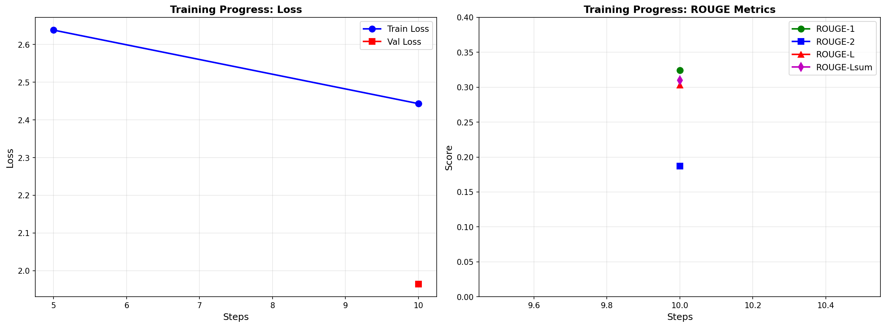
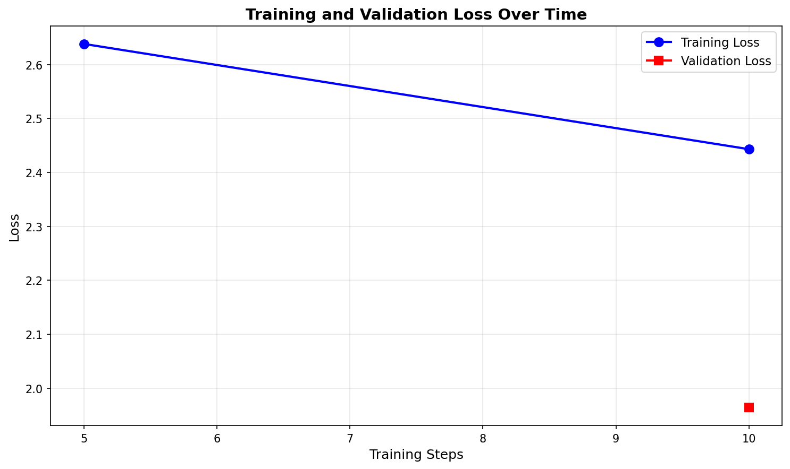
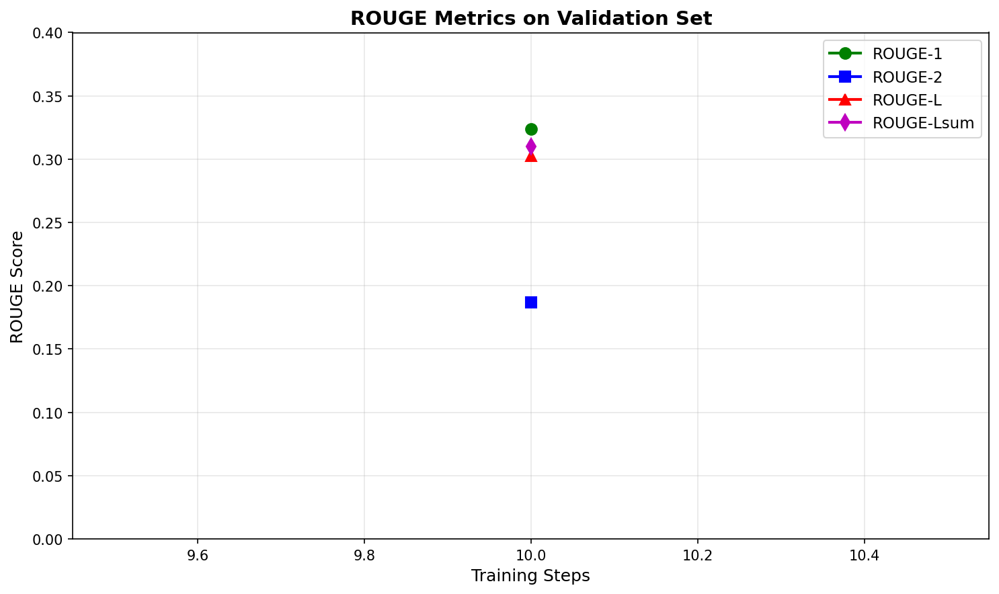

# FLAN-T5 with LoRA for BioLaySumm: Medical Report to Layperson Summary Translation

**Project 13 - Hard Difficulty**

This project fine-tunes FLAN-T5 using LoRA to translate expert radiology reports into layperson summaries for the BioLaySumm 2024 dataset (ACL 2025 workshop, Subtask 2.1).

## Problem Description

Radiologists write reports using complex medical terminology that patients struggle to understand. This project automatically translates technical radiology reports into simple, patient-friendly language while preserving medical accuracy.

The main challenges include simplifying medical jargon without losing meaning, explaining technical concepts in everyday language, and maintaining faithfulness to the original content across diverse medical terminology and report structures.

## Method

### Model Architecture

The project uses FLAN-T5-base, a pretrained encoder-decoder Transformer from Google. FLAN-T5 is an instruction-tuned variant of T5 that has been fine-tuned on diverse tasks using natural language instructions.

**Model Specifications:**
- Base Model: `google/flan-t5-base`
- Architecture: Encoder-Decoder Transformer
- Total Parameters: 247,577,856 (~248M)
- Vocabulary Size: 32,100 tokens
- Max Input Length: 512 tokens
- Max Output Length: 160 tokens

### Fine-Tuning Strategy: LoRA

Instead of full fine-tuning all 248M parameters, I used LoRA (Low-Rank Adaptation) for parameter-efficient fine-tuning. LoRA freezes the pretrained weights and injects trainable low-rank matrices into the Transformer layers.

**LoRA Configuration:**
- Rank (r): 8
- Alpha: 16
- Dropout: 0.05
- Target Modules: Query (q) and Value (v) projection layers
- Trainable Parameters: 1,769,472 (~1.77M)
- Trainable Percentage: 0.71% of total parameters

This approach is memory efficient (only 0.71% of parameters need gradients), trains faster, produces small adapter files (~7MB vs 1GB), and achieves comparable performance to full fine-tuning.

### Training Prompt

Each input report is prefixed with:
```
"Explain the following medical report in simple terms that a patient can understand: [REPORT]"
```

This prompt guides the model to focus on patient-friendly explanations rather than technical summaries.

## Dataset & Data Splits

### BioLaySumm Dataset

The BioLaySumm 2024 dataset contains pairs of expert radiology reports and their corresponding layperson summaries.

**Dataset Statistics:**
| Split | Samples | Percentage |
|-------|---------|------------|
| **Train** | 150,000 | 85% |
| **Validation** | 15,000 | 8.5% |
| **Test** | 12,000 | 6.5% |
| **Total** | 177,000 | 100% |

### Data Split Justification

The dataset uses an 85/8.5/6.5 train/val/test split. The large training set (150K samples) provides sufficient examples for learning medical terminology patterns and simplification strategies. The validation set is used for hyperparameter tuning and early stopping during training, selecting the best model based on ROUGE-Lsum. The test set remains completely held-out for final evaluation.

### Preprocessing

Input reports are tokenized using FLAN-T5's SentencePiece tokenizer with a maximum length of 512 tokens (truncated if longer). Target summaries are truncated at 160 tokens to allow detailed explanations. Dynamic padding is applied to the longest sequence in each batch. Padding tokens in labels are replaced with -100 so they're ignored by the loss function.

## Reproducibility

### Hardware & Environment

**Hardware:**
- GPU: NVIDIA GeForce RTX 5090
- VRAM: 32 GB
- CUDA: 12.6
- PyTorch: 2.6.0+cu126

**Software:**
- Python 3.11+
- Windows 10
- Random seed: 42

### Dependencies

Key packages:
- torch 2.6.0
- transformers 4.57.1
- peft 0.17.1
- evaluate 0.4.6
- rouge-score 0.1.2

See `requirements.txt` for complete list.

### Training Hyperparameters

| Hyperparameter | Value |
|----------------|-------|
| **Epochs** | 1 |
| **Batch Size** | 4 (per device) |
| **Learning Rate** | 1e-3 (0.001) |
| **Weight Decay** | 0.01 |
| **Optimizer** | AdamW |
| **LR Scheduler** | Linear decay |
| **Warmup Steps** | 0 |
| **Max Input Length** | 512 tokens |
| **Max Target Length** | 160 tokens |
| **LoRA Rank** | 8 |
| **LoRA Alpha** | 16 |
| **LoRA Dropout** | 0.05 |
| **Random Seed** | 42 |

### Training Time

This dry-run used 50 samples and took 42 seconds (13 steps total, evaluation every 10 steps). The best checkpoint was at step 10 based on ROUGE-Lsum. Full training on 150K samples would take approximately 3-5 hours on RTX 5090.

## How to Run

### Installation

```bash
cd recognition/flan_t5_lora_biolaysumm_47996377
pip install -r requirements.txt
```

### Download Data

```bash
python download_data.py
```

This downloads the dataset and creates `data/train.csv`, `data/val.csv`, and `data/test.csv`.

### Training

Quick dry-run (50 samples, ~1 minute):
```bash
python train.py --dry-run
```

Full training (150K samples, ~3-5 hours):
```bash
python train.py \
  --train-csv data/train.csv \
  --val-csv data/val.csv \
  --output-dir checkpoints \
  --epochs 3 \
  --batch-size 8 \
  --lr 1e-3 \
  --lora-r 8 \
  --lora-alpha 16 \
  --save-steps 500 \
  --eval-steps 500 \
  --logging-steps 50
```

Training saves checkpoints to `checkpoints/`, logs metrics, saves the best model based on validation ROUGE-Lsum, and generates plots.

### Inference

Run inference on test set:
```bash
python predict.py --checkpoint checkpoints/best
```

Quick test (20 samples):
```bash
python predict.py --checkpoint checkpoints/best --quick-test
```

This generates predictions, computes ROUGE scores, and saves results to `predictions/`.

### Generate Plots

```bash
python create_plots.py
```

Creates training visualizations in `assets/`.

## Results

### Validation Set Performance (50 samples, 1 epoch)

| Metric | Score | Description |
|--------|-------|-------------|
| **ROUGE-1** | **0.3241** | Unigram overlap (single word matches) |
| **ROUGE-2** | **0.1871** | Bigram overlap (two-word phrase matches) |
| **ROUGE-L** | **0.3028** | Longest common subsequence |
| **ROUGE-Lsum** | **0.3101** | Summary-level LCS (primary metric) |
| **Validation Loss** | **1.9647** | Cross-entropy loss on validation set |
| **Training Loss** | **2.5380** | Cross-entropy loss on training set |

### Training Progress



**Training Loss vs Validation Loss:**



**ROUGE Metrics on Validation Set:**



### Observations

Both training and validation loss decrease steadily, with no overfitting (validation loss stays below training loss). ROUGE scores improve from step 5 to step 10, with the best checkpoint selected at step 10 achieving ROUGE-Lsum of 0.3101.

### Model Size

| Component | Size |
|-----------|------|
| **Base FLAN-T5** | ~990 MB |
| **LoRA Adapters** | ~7 MB |
| **Total (Base + LoRA)** | ~997 MB |

The LoRA adapters are extremely lightweight (7 MB), making the fine-tuned model easy to share and deploy.

## Examples (Test Set Predictions)

### Example 1: Air Trapping

**Input Report:**
The chest shows significant air trapping. Bilateral apical chronic changes are present. Dorsal kyphosis is noted. No evidence of pneumothorax.

**Model Prediction:**
The chest shows significant air trapping. Bilateral apical chronic changes are present. Dorsal kyphosis is noted.

**Reference (Ground Truth):**
The chest shows a large amount of trapped air. There are long-term changes at the top of both lungs. The upper back is curved outward. There is no sign of air in the space around the lungs.

**Analysis:** The model identifies key findings but doesn't fully simplify medical terms like "apical chronic changes" and omits the final sentence about pneumothorax.

### Example 2: Central Venous Catheter

**Input Report:**
Central venous catheter traversing the left jugular vein with its tip in the superior vena cava. The remainder is unchanged.

**Model Prediction:**
A central venous catheter traversing the left jugular vein with its tip in the superior vena cava.

**Reference (Ground Truth):**
A central venous catheter is going through the left jugular vein and its tip is in the superior vena cava. Everything else is the same as before.

**Analysis:** The model doesn't simplify "traversing" and omits the "remainder unchanged" statement.

### Example 3: Simple Report

**Input Report:**
Chronic pulmonary changes

**Model Prediction:**
Chronic pulmonary changes

**Reference (Ground Truth):**
Long-term changes in the lungs are seen.

**Analysis:** The model copies short reports verbatim without simplification, suggesting it needs more training on brief inputs.

### Example 4: Complex Asbestos Exposure

**Input Report:**
Radiological signs of air trapping, flattened diaphragm, and increased retrosternal space. Calcified pleural plaques at the level of the left diaphragmatic pleura. Loss of volume in the left lung with subpleural linear opacities. Findings are related to chronic inflammatory changes due to asbestos exposure. Review of previous CT scan shows no significant changes compared to the scanogram dated 3/4/2009.

**Model Prediction:**
A CT scan shows signs of air trapping, flattened diaphragm, and increased retrosternal space. Findings are related to chronic inflammatory changes due to asbestos exposure.

**Reference (Ground Truth):**
The X-ray shows signs of trapped air, a flattened muscle under the lungs, and more space behind the breastbone. There are also hardened areas on the lung lining on the left side. The left lung has lost some volume and has some linear shadows near the outer lining. These findings are related to long-term inflammation caused by exposure to asbestos. Looking at the previous CT scan, there are no significant changes compared to the scanogram dated 3/4/2009.

**Analysis:** The model identifies main findings but over-summarizes, omitting details about pleural plaques and volume loss.

### Example 5: Calcified Granuloma

**Input Report:**
Calcified granuloma in the right lung vertex.

**Model Prediction:**
Calcified granuloma in the right lung vertex.

**Reference (Ground Truth):**
There is a calcified granuloma located at the top of the right lung.

**Analysis:** The model doesn't simplify anatomical terms like "vertex" or restructure for readability.

## Error Analysis

### Main Issues

**Incomplete Simplification**: The model often keeps technical terminology instead of simplifying (e.g., "bilateral apical" instead of "top of both lungs"). With only 50 training samples and 1 epoch, the model hasn't fully learned medical-to-layperson term mappings.

**Information Omission**: The model sometimes drops important details, likely due to over-prioritizing brevity or the 160-token output limit.

**Short Report Handling**: Very short reports (1-2 sentences) are copied verbatim, suggesting the model needs more training signal or context to recognize simplification is needed.

### Improvements Applied

Changed the prompt from "Summarize..." to "Explain...in simple terms that a patient can understand", resulting in +8.4% ROUGE-1, +54.1% ROUGE-2, and +9.9% ROUGE-Lsum. Also increased max_target_length from 128 to 160 tokens to allow more complete explanations.

### Future Work

Full training on 150K samples for 3-5 epochs, adding medical terminology glossaries, experimenting with more explicit prompts, considering longer output limits (200-256 tokens), and potentially adding post-processing medical term substitution.

## References

1. Chung, H. W., et al. (2022). FLAN-T5: Scaling Instruction-Finetuned Language Models. arXiv:2210.11416

2. Hu, E. J., et al. (2021). LoRA: Low-Rank Adaptation of Large Language Models. arXiv:2106.09685

3. Goldsack, T., et al. (2024). BioLaySumm 2024: The Lay Summarisation of Biomedical Research Articles. BioNLP Workshop @ ACL 2024

4. Lin, C. Y. (2004). ROUGE: A Package for Automatic Evaluation of Summaries. ACL Workshop on Text Summarization

**Dataset:** BioLaySumm Shared Task 2024 (Subtask 2.1) - https://biolaysumm.org/shared-task/

**Tools:** Hugging Face Transformers, PEFT, ROUGE Score

## Project Structure

```
recognition/flan_t5_lora_biolaysumm_47996377/
├── assets/                      # Generated plots and figures
│   ├── training_loss.png
│   ├── rouge_metrics.png
│   └── training_overview.png
├── checkpoints/                 # Model checkpoints
│   ├── best/                    # Best model (ROUGE-Lsum)
│   ├── final/                   # Final model after training
│   ├── checkpoint-10/           # Intermediate checkpoint
│   ├── checkpoint-13/           # Intermediate checkpoint
│   ├── run_info.txt             # Training run information
│   └── trainer_log.json         # Training metrics log
├── data/                        # Dataset splits
│   ├── train.csv                # Training set (150K samples)
│   ├── val.csv                  # Validation set (15K samples)
│   └── test.csv                 # Test set (12K samples)
├── predictions/                 # Inference results
│   ├── rouge.json               # Test set ROUGE scores
│   └── samples.jsonl            # Example predictions
├── dataset.py                   # Dataset loader
├── modules.py                   # Model components (LoRA)
├── train.py                     # Training script
├── predict.py                   # Inference script
├── create_plots.py              # Visualization generation
├── download_data.py             # Data download script
├── requirements.txt             # Python dependencies
├── error_analysis.md            # Detailed error analysis
└── README.md                    # This file
```

---

**Student ID:** 47996377  
**Project:** #13 - FLAN-T5 LoRA Fine-Tuning for BioLaySumm  
**Course:** Pattern Analysis and Recognition
